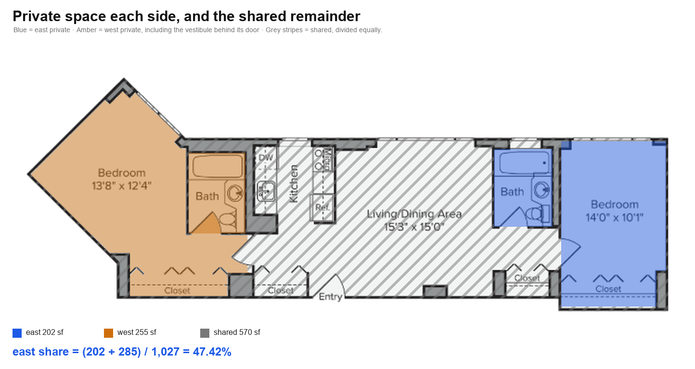

# Apartment 24A — floor areas and rent split

Each side's share of the rent, from floor areas measured off the published plan
rather than estimated. The two sides are **A** (blue) and **L** (orange).
Reproducible — no area or share below was typed in by hand:

```
python measure.py      # areas, scale checks, figures
python split.py         # rent, shares, sensitivity
```

Needs `numpy` and `pillow`.

## The rule

Each side pays for the space only they use, plus half the space both use:

```
share = (own area + shared area / 2) / total area
```

"Own" means behind a door only one side passes through.

## The rent

Resident portal, 18 September 2026. Current lease ends 17 Nov 2026.

| | Today | Renewal |
|---|---|---|
| Base rent | $6,486 | $6,881 |
| Amenities | $200 | $200 |
| Internet | $65 | $92 |
| Liability | $10 | $10 |
| **Total** | **$6,761** | **$7,183** (+6.2%) |

Today's payments reconcile exactly: A $3,333 + L $3,428 = $6,761, so A pays
**49.30%**.

## The areas


| | Bedroom | Closet | Bath | **Own** |
|---|---|---|---|---|
| **A** | 127 | 32 | 43 | **202 sf** |
| **L** | 172 | 40 | 43 | **255 sf** |
| Shared | living/dining, kitchen, entry | | | **570 sf** |

Total published: **1,027 sf**. L has **26% more** own space than A.

**L's bedroom, closet and bathroom are all behind one door**, the one between
L's bathroom and the kitchen. A's are not. L's bedroom figure therefore
includes the floor in front of L's bathroom, and L's closet is the whole run
inside that door.

Two details that work in A's favour and are counted anyway: the bathrooms match
to within 1 sf, and **L's closet is the larger** of the two, 40 against 32.

## The result



| | Share | Today | Renewal |
|---|---|---|---|
| As paid today | 49.30% | $3,333 | $3,541 |
| **By the rule** | **47.42%** | **$3,206** | **$3,406** |

A is paying **$127/month more than the rule gives**; carrying 49.30% into the
renewal rather than recalculating makes that **$135/month, $1,620 a year**.

This is not a claim that A's rent should fall — at 47.42% A still pays **$200
more** on renewal than today, because the apartment itself rose $422. The split
decides who absorbs that, not whether it happens.

## Could any other rule give 49.30%?

There are only **two** ways to treat the shared space: halve it, or allocate it
in proportion to own space. "Ignore the shared space and split by own space
alone" looks like a third, but it gives *identically* the pro-rata number — with
`p = a/(a+l)` and `s = a+l`, so `a = ps`:

```
(a + (T - s)·p) / T  =  (ps + (T - s)·p) / T  =  p·(s + T - s)/T  =  p
```

Allocating the shared space in proportion to own space cannot change the ratio
it is applied to, so the total drops out. `split.py` crosses the two real
treatments with every reasonable definition of own-space:

| Own space defined as | Halve rest | Pro-rata |
|---|---|---|
| bedrooms only | 47.84% | 42.57% |
| bedrooms + closets | 47.42% | 42.87% |
| **bedrooms + closets + baths** | **47.42%** | 44.19% |

**No.** Every cell lands between 42.57% and 47.84%, so 49.30% is not a
variation of this rule under any definition — it sits 1.5 points above all of
them. Halving is the treatment closest to it; pro-rata moves away. To reach
49.30% under the rule, A would need 304 of the 570 shared sf — 53% of the
living room, kitchen and halls.

## Method

Commented in full in `measure.py`. In short:

1. **Scale is derived, not assumed.** The plan labels the living/dining
   15'3" × 15'0"; wall-to-wall that measures 163 px for 15.25 ft and 162 px for
   15.0 ft — 10.69 and 10.80 px/ft. The axes agreeing to within 1% is what
   shows the drawing is to scale. 10.75 px/ft is used.
2. **Checked against a different room.** A's printed 10'1" bedroom width
   measures 109 px → 10.81 px/ft, within **0.6%**.
3. **Areas are flood-filled**, not estimated. Doors are sealed first so a fill
   stays in one space; text and fixtures inside a space are counted as floor.
4. **Known gap:** interior floor measures 940 sf against the published 1,027 —
   the usual rentable-area gross-up. Proportions are unaffected; 1,027 is the
   denominator so shares match the lease.
5. **Where the plan is ambiguous:** A's bedroom is printed 14'0" deep but only
   135 px to its closet partition against 150 px for 14'0", so the printed
   depth runs into the closet. That is why bedrooms and closets are reported
   separately and no single "bedroom size" is quoted.

**To dispute the result**, in order of leverage: `L_CLOSET_FACE_Y` and the
`SEALS` coordinates in `measure.py`, which decide where one space ends and the
next begins; then the denominator, where using the measured 940 instead of
1,027 moves the share by 0.24 points. Changing the scale does almost nothing —
it cancels out of a ratio of areas.
