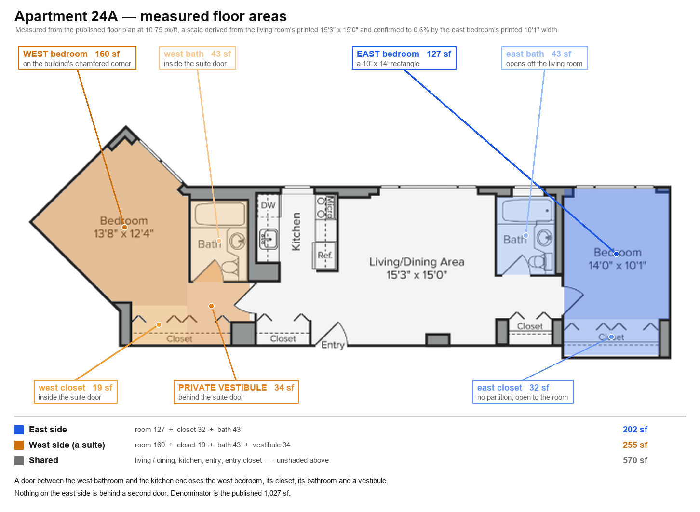
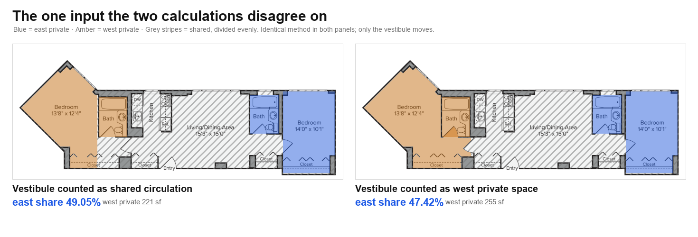

# Apartment 24A — floor areas and rent split

Working out each occupant's share of the rent from the floor areas, measured
from the published floor plan rather than estimated.

Everything below is reproducible. `measure.py` derives the areas from
[`plan.png`](./plan.png) and writes the figures; `split.py` does the
arithmetic. No area or share in this document was typed in by hand.

```
python measure.py      # areas, scale checks, figures
python split.py        # rent, shares, sensitivity
```

Needs only `numpy` and `pillow`.

---

## The rent

From the resident portal, 18 September 2026.

| Charge | Today | Renewal | Change |
|---|---|---|---|
| Base rent | $6,486 | $6,881 | +$395 (+6.1%) |
| Common Area / Amenities | $200 | $200 | — |
| Technology Connect (internet) | $65 | $92 | +$27 (+41.5%) |
| Liability insurance | $10 | $10 | — |
| **Total** | **$6,761** | **$7,183** | **+$422 (+6.2%)** |

The current lease runs to 17 Nov 2026; the renewal covers 18 Nov 2026 to
17 Nov 2027.

**Today's payments reconcile exactly:** east $3,333 + west $3,428 = $6,761, so
east is paying **49.30%**. (The portal's headline "$6,751/month" is the same
figure without the separately-billed $10 liability line.)

---

## The rule

Each occupant pays for the space only they can use, plus an equal part of the
space both use:

```
share = (private area + shared area / 2) / total area
```

"Private" means **behind a door only one occupant passes through**. That is the
only definition worth stating, because it is the only thing the two
calculations below disagree about.

---

## The measured areas



| | Bedroom | Closet | Bath | Private hall | **Private total** |
|---|---|---|---|---|---|
| **East** | 127 sf | 32 sf | 43 sf | — | **202 sf** |
| **West** | 160 sf | 19 sf | 43 sf | 34 sf | **255 sf** |
| Shared | living/dining, kitchen, entry, entry closet | | | | **570 sf** |

Total: the landlord publishes **1,027 sf**, which is the denominator used
throughout.

Three things in that table matter more than the headline sizes:

- **The west side is a suite.** A door between the west bathroom and the
  kitchen encloses the west bedroom, its closet, its bathroom *and* a
  **34 sf vestibule**. Nothing on the east side sits behind a second door.
- **The two bathrooms are the same size** to within 1 sf, so counting them as
  private or shared barely changes the result either way.
- **The east closet is the larger of the two**, 32 sf against 19. Counting
  closets therefore works slightly *against* east, and they are counted here.

West holds **26% more private space** than east.

---

## The result

| | Share | Today | Renewal |
|---|---|---|---|
| As actually paid today | 49.30% | $3,333 | $3,541 |
| Vestibule counted as shared circulation | 49.05% | $3,316 | $3,523 |
| **Vestibule counted as west private space** | **47.42%** | **$3,206** | **$3,406** |

Arithmetic: `(202 + 570/2) / 1027 = 47.42%`.

So east is paying **$127/month more than the rule gives**, and carrying 49.30%
into the renewal instead of recalculating would make that **$135/month —
$1,620 a year**.

**This is not a claim that east's rent should fall.** At the corrected share
east still pays **$200 more** on renewal than today ($3,206 → $3,406), because
the apartment itself went up $422. Fixing the split changes who absorbs that
increase, not whether it happens.

---

## The one disputed input



Identical method in both panels. The only difference is whether the hallway
behind the suite door is shared circulation or west's private space.

---

## Does anything other than halving explain the 49.30%?

This is the obvious challenge to the result, so `split.py` tests it directly:
every reasonable definition of "private", crossed with every reasonable
treatment of the shared remainder.

| Private space defined as | Halve the rest | Pro-rata | Ignore the rest |
|---|---|---|---|
| bedrooms only | 48.43% | 44.38% | 44.38% |
| bedrooms + closets | 49.06% | 47.13% | 47.13% |
| bedrooms + closets + baths | 49.05% | 47.69% | 47.69% |
| **+ west vestibule** | **47.42%** | 44.19% | 44.19% |

**No.** Halving lands closest to 49.30% in every single row, and both
alternatives move *further* away — and always downward, never up. So no
treatment of the shared space can produce 49.30% once the vestibule is counted
as private.

To reach 49.30% *while* counting the vestibule as private, east would have to
be allocated **304 of the 570 sf** of shared space: 53% of the living room,
kitchen and halls. No rule gives one occupant a majority of the space both use.

The 1.88-point gap between 49.30% and 47.42% decomposes cleanly:

| | Points | Share of the gap |
|---|---|---|
| The vestibule | 1.63 | 87% |
| Rounding in how the original figure was set | 0.25 | 13% |

**The disagreement is about one door, not about the method.**

---

## Method, and how to dispute it

All of this is in `measure.py`, which is commented at the level needed to
check it line by line. The short version:

**1. Scale — derived, not assumed.** The plan labels the living/dining area
15'3" × 15'0". Measured wall-to-wall that is 163 px for 15.25 ft and 162 px for
15.0 ft, i.e. **10.69 and 10.80 px/ft**. The two axes agreeing to within 1% is
what establishes the drawing is to scale rather than stretched. The midpoint,
10.75 px/ft, is used throughout.

**2. Scale checked against a different room.** The east bedroom's printed
**10'1" width** measures 109 px, implying 10.81 px/ft — within **0.6%** of the
figure above, derived from a room that played no part in setting it.

**3. Areas — flood-filled, not estimated.** Each space is isolated by filling
the plan's white interior with any pixel darker than a threshold acting as a
barrier. Door openings are sealed first so a fill stays in one room; text and
fixtures inside a room are filled back in and counted as floor.

**4. A known limitation, stated plainly.** Interior floor measured this way
totals **940 sf against the published 1,027** — an 8% gap that is the usual
rentable-area gross-up (wall thickness plus a share of common structure).
Proportions are unaffected, and 1,027 is used as the denominator so shares are
expressed against the number on the lease.

**5. Where the plan is genuinely ambiguous, and why it doesn't matter.** The
east bedroom's printed **14'0" depth** is *not* used as a check: 14'0" at this
scale is 150 px, but the room's north wall to its closet partition is 135 px.
The printed depth runs into the closet recess, so a single "bedroom area" taken
from the label alone could be anywhere from 127 sf to 159 sf. This is why rooms
and closets are reported as separate numbers here and no single "bedroom size"
is quoted. It does not affect the conclusion, because the same treatment is
applied to both sides and the closets are counted.

**To dispute the result**, the productive targets are, in order:

1. **Whether the vestibule is private.** It is worth 1.63 of the 1.88 points.
   This is a question about the door, answerable by standing in the hallway.
2. **The seal positions** in `measure.py` (`SEALS`) — these decide where one
   room ends and the next begins. Move them and re-run.
3. **The 1,027 sf denominator.** Using the measured 940 sf instead changes the
   shares by under half a point, because both sides scale together.

Changing the scale does almost nothing: it cancels out of a ratio of areas.
